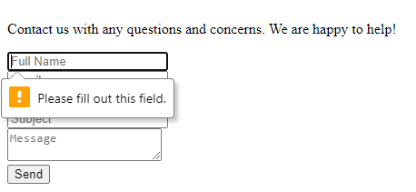

<h1>GoJim! System Manual</h1>

This document presents and defines the minimum amount of information needed to start, initialize, and use our website, GoJim!, on each system. In addition, we will also include explanations of error messages, a simple installation guide, contact information of the developers, minimum hardware and software requirements, and a simple installation guide.

<h2>Overview</h2>
<ol>
<li><a href="#minSoftware">Minimum Software and Hardware Requirements</a></li>
<li><a href="#install">Installation Guide</a></li>
<li><a href="#errors">Explanation of Error Messages and Troubleshooting Guides</a></li>
<li><a href="#contactinfo">Contact Information of Developers</a></li>
</ol>

<h2 id="minSoftware">Minimum Software and Hardware Requirements</h2>

<h3>Hardware Requirements</h3>
<ul>
<li>A computer or mobile device with internet access</li>
<li>A display with a resolution of at least 1024x768 pixels</li>
<li>Recommended: At least 4GB of RAM for optimal performance</li>
<li>Recommebded: Dual Core 1GHz CPU</li>
</ul>

<h3>Software Requirements</h3>
<ul>
<li>Safari 13 (or higher), Microsoft Edge 93 (or higher), Google Chrome 93 (or higher), Mozilla Firefox 70 (or higher)</li>
<li>Git: Install Git or use integrated Replit Git commands to clone our repository</li>
<li>Terminal Emulator: Terminal (macOS), Command Prompt (Windows), GNOME Terminal (Linux)</li>
<li>Latest versions of Linux, macOS, iOS, Android OS, or Windows</li>
</ul>

<h3>Dependencies</h3>
<ul>
<li>PHP: PHP is a server-side scripting language used for web development. Refer to this link to integrate PHP Web Server for our website, <a href="https://replit.com/new/php7">PHP Web Server Link</a></li>
<li>Node.js is a JavaScript runtime that allows you to run JavaScript on the server side. Refer to this link to download Node.js on your local machine for our website, <a href="https://nodejs.org/en/download">Node.js Official Website</a></li>
<li>Firebase SDK: Firebase SDK incorporates all of the necessary tools and libraries to access our website. Refer to this link to view Firebase documentation, <a href="https://firebase.google.com/docs">Firebase SDK</a></li>
</ul>

<h2 id="install">Installation Guide</h2>

<h3>Prequisites</h3>

Before using our website, make sure you have the following:
<ul>
<li>A Replit account: If you have not made one yet, go to Replit's official website to create one: <a href="https://replit.com/~">Replit Sign-Up</a></li>
<li>All of the necessary software and hardware requirements</li>
</ul>

<h3>Steps</h3>
<ol>
<li>Log in to your Replit account and navigate to our project's repository: <a href="https://replit.com/@JackieCheng/GoJimWebsite">GoJim! Repository</a></li>
<li>Navigate to the 'Shell' feature on Replit and proceed to type in "git clone https://replit.com/@JackieCheng/GoJimWebsite-3" in the newly opened Terminal Prompt.</li>
<li>Once the project is downloaded, type "cd GoJimwWebsite" to access our repository from the Terminal.</li>
<li>Using Git commands, you can edit, navigate, and use all of the necessary files, pages, documentation, and templates that were created by our developers.</li>
</ol>

<h2>Common Error Messages and Troubleshooting Guides</h2>

<h3>Create an Account</h3>

<ul>
<li>Given that the user entered nothing within the 'Email' text box, this error will appear: 

This error occurs because of Firebase's authentication system. As a result of our database configuration, all emails that are going to be registered with GoJim must be a combination of strings, in correspondence to the formatting of a proper email as such 'string@emailprovider'. Since the user did not enter a string, Firebase cannot validate the email, therefore, alerting the user that an invalid email was given. In order to solve this problem, instruct the user to type in a valid email that they want to associate with GoJim! into the corresponding textbox and hit 'Register'.</li>

<li>Given that the user entered all of the correct information to create an account, but your password is less than 6 characters, this error will appear: 

This error occurs because of Firebase's authentication system. As a result of our database configuration, all passwords stored will be stored under a certain user's node within our database. For the purposes of data security and user protection, a weak password will not be acceptable, as a short password can result in malicious users brute-force our systems and bypassing our login system by guessing one's password. Therefore, you must enter a valid password by making the password greater than or equal to 6 characters. Afterward, the user can attempt to hit 'Register' to see if all of the requirements are met. </li>

</ul>

<h3>Login</h3>
<ul>
<li>Given that the user entered an email that has not been associated with our database, this error will appear: 

This error occurs because of Firebase's authentication system. As a result of our database configuration, all emails and sensitive information are stored within the 'users' node. Whenever the user wants to log in, the script will reference our database and check if the email and password are associated with a user ID within our database, respectively. In this case, top-down processing was employed and the database did not return a user associated with this email. In order to address this address, the user could be instructed to verify and check that the email they entered contains all of the necessary syntax and symbols that match the email they created their account with. Afterward, the user can proceed to hit the 'Sign In' button to enter our website.</li>

<li>Given that the user entered a password that does not match the corresponding email, this error will appear: 

This error occurs because of Firebase's authentication system. As a result of our database configuration, all passwords are associated with a unique user ID. The database verifies that the email does not exist within our database and moves on to the next conditional in the script. Next, the database will reference the node of 'password' and compare the syntax of the stored password and the password entered by the user. In this case, the passwords were not matching and the authentication process failed. To address this technical issue, the user should attempt to verify the capitalization, letter, number placement, and dates of their passwords to ensure that the entered password was the password associated with the creation of their account.</li>
</ul>
<h3>Profile</h3>
<ul>
<li>Given that the user submits a non-image type file into our profile picture upload system, this error will appear:

This error occurs because of the Windows operating system environment. As a result of the limitations of Windows systems, files must be expected to be uploaded into the desired format. Whenever a user attempts to submit a file such as an application into a system that is expecting an image, the 'Catastrophic Error' will arise because of Window safeguards. To avoid this error, the user must ensure that they are only looking for images by verifying the file type (.jpg, jpeg, .png, .gif are all acceptable for the purposes of our upload system. Successful submission of a profile picture will not have any direct response, but the same file will be available for upload by clicking the 'Upload' button.
</ul>
<h3>Contact Us</h3>

<ul>
<li>Given that the user enters a string without the proper email formatting (string@emailprovider), this error should appear:

This error occurs because of the default Javascript alerting system for improper inputs. As required by FormSubmit, the third-party software to facilitate the flow of our Contact Us system, the entered emails need to be properly formatted, so the FormSubmit API can properly recognize the email, connect to the host, and proceed to send a confirmation email to our company email, as well as the user's email to confirm the submission of their preference, complaint, or suggestion for our developers. In order to address this error, the user should ensure that they are including an '@' symbol between their email and the cloud service that acts as the email provider. Then, the user should attempt to submit the form once again until they are met with the successful submission page.</li>

<li>Given that the user does not enter anything into any of the text fields for the form, this error should appear:

This error occurs because of the default JavaScript alerting system for improper inputs. Within our script, we designed the event listeners to analyze the input for any data type, which includes strings and integers. However, the event listener will not be activated without any inputs, as seen in this case. Under these circumstances, JavaScript will alert the user that text fields cannot be empty, as FormSubmit would not have any information to send the confirmation email to the user or transfer the details of the user to the developers. To address this problem, the user should ensure that they are typing in the designated textboxes with all of the proper formattings and proceed to hit the 'Submit' button. </li>

</ul>

<h3>Calculators</h3>

<ul>
<li>Given that the user enters a height of 0 centimeters for our BMI calculator, this error should appear:

This error occurs because of JavaScript's default response for division by 0. According to JavaScript's arithmetic operations, integers cannot be divided as 0, as this leads to a sign-analysis between negative infinity and positive infinity. In this case, the weight of the user was valid, but the insertion of 0 cm will cause this error, as 100/0 would go toward positive infinity, given that the computation was evaluated at the limit of n approaching infinity. To avoid this error, the user should make sure that they are entering a valid height, where the values of heights are greater than 0.</li>

<h2>Contact Information</h2>

Feel free to reach out to our developers for additional inquiries or if any undocumented errors arise.

<h3>Meet our developers!</h3>

<ul>Jackie Cheng
<li>Email: jc4653@drexel.edu</li>
<li>Discord: Vague#2592</li>
<li>Meeting Location: 3675 Market Street Room 910-911 1-2:50 pm </li>
</ul>

<ul>Lorenz Aparentado
<li>Email: lea54@drexel.edu</li>
<li>Discord: PigeonMan#1460</li>
<li>Meeting Location: 3675 Market Street Room 910-911 1-2:50 pm </li>
</ul>

<ul>Richmond Nguyen
<li>Email: rhn29@drexel.edu</li>
<li>Discord: Kidk#6640</li>
<li>Meeting Location: 3675 Market Street Room 910-911 1-2:50 pm </li>
</ul>

<ul>Amaro Truong
<li>Email: at3499@drexel.edu</li>
<li>Discord: hoat#2188</li>
<li>Meeting Location: 3675 Market Street Room 910-911 1-2:50 pm </li>
</ul>
